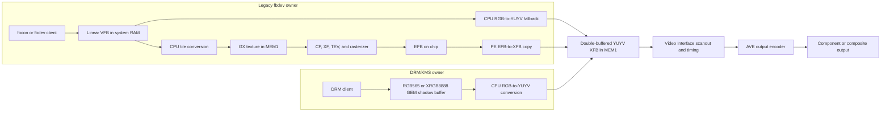
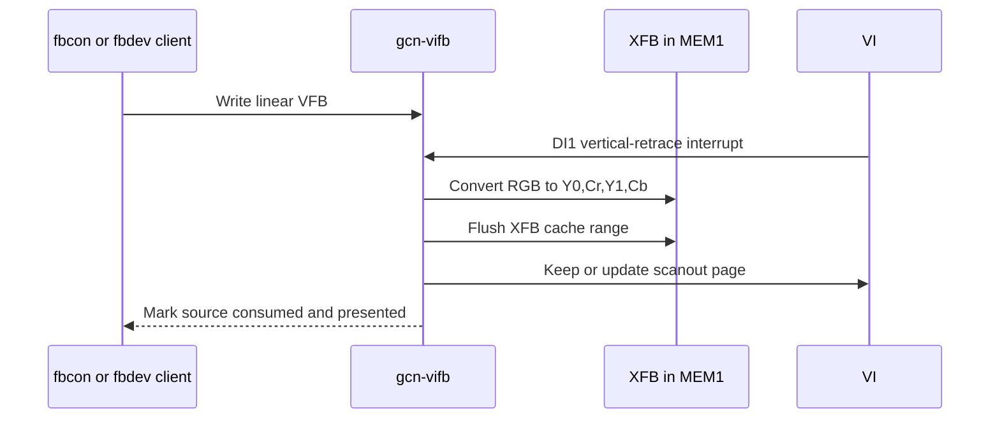
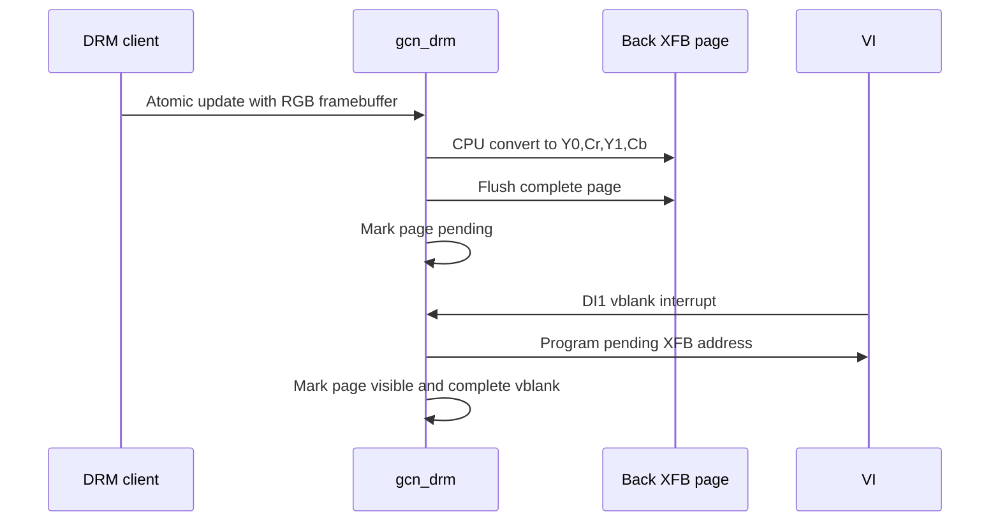
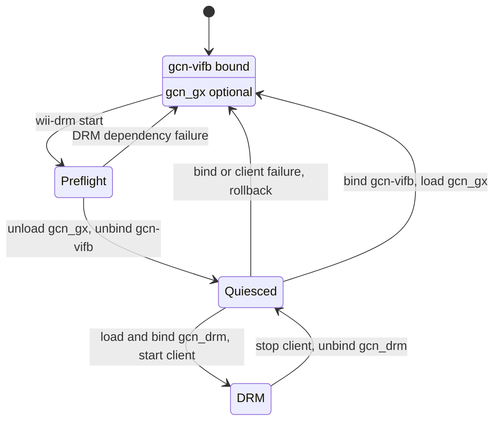

# Wii video architecture and ownership model

This document describes the video pipeline used by the Linux 6.18 Wii port,
the ownership boundaries implemented by the current drivers, and the hardware
model supported by testing through 2026-08-03. It is the stable companion to
the chronological [GX/DRM test ledger](wii-6.18-gx-port.md).

The immediate unresolved issue is a nondeterministic downstream color phase:
the same correct XFB bytes can be displayed either correctly or with red/blue
and Cr/Cb interpretation exchanged. A VI DCR reset-pulse test is staged in
commit `51ff89e12`, with procedure commit `8dde5b203`, but has not been run on
hardware. Nothing in this document treats that candidate as a result.

## Evidence labels

Architecture claims use these labels:

- **Proven on hardware**: observed with a validated positive control and, where
  relevant, a full-frame visual result.
- **Source contract**: directly implemented by the kernel, device tree, tool,
  or audited reference source.
- **Inference**: the smallest model consistent with the current evidence, but
  not a documented silicon guarantee.
- **Unknown**: an open question that must not be assumed by production code.

This distinction matters because several Hollywood registers are command
strobes, write-one-to-clear status, self-clearing controls, or otherwise do not
behave as ordinary byte-addressable storage.

## Pipeline overview

There are two implemented Linux display paths. They share the physical XFB,
VI, and external encoder, but they do not share a display owner.



Only one of the two owners may be bound to `c002000.video` at a time:

- `gcn-vifb` owns VI in legacy mode. The reloadable `gcn_gx` module is an
  optional rendering accelerator registered with that owner.
- `gcn_drm` owns VI in DRM/KMS mode. It currently performs conversion on the
  CPU and does not use `gcn_gx` or the EFB.

The external HDMI capture path used during development is downstream of the
Wii output connector and is not part of the SoC pipeline.

## Hardware blocks

| Block | Current responsibility | Evidence |
| --- | --- | --- |
| Broadway CPU | Runs fbdev/DRM clients, tiles linear source pixels for GX, or converts RGB directly to YUYV. Performs explicit cache maintenance around shared memory. | Source contract |
| MEM1 | Contains GX-addressable textures, the GX FIFO, and VI-scanned XFBs. | Device tree and source contract |
| MEM2 | General Linux memory. The current GX texture path does not assume that the texture unit can fetch from it. | Source contract; observed reason for MEM1 reservations |
| CP | Consumes the GX FIFO and dispatches commands to the fixed-function pipeline. | Source contract; FIFO drain observed on hardware |
| XF | Vertex transform, viewport, and clipping stages. | Source-derived hardware model |
| BP/TEV/raster | Configures texture sampling, color combination, rasterization, and EFB copy state. BP is a command/register interface, not a CPU-visible framebuffer. | Source-derived hardware model |
| EFB | On-chip render target written by GX primitives and read by the copy engine. It is not an ordinary CPU-mapped Linux framebuffer. | Source-derived; direct-color and copy tests proven on hardware |
| PE | Completes raster/copy work, emits token/finish observations, and copies EFB to XFB with RGB-to-YUV conversion. | Source contract; PE token and EFB-copy positive controls |
| VI | Scans physical XFB memory, selects top/bottom field addresses, generates display interrupts, and owns timing/mode registers. | Source contract and hardware tests |
| AVE | Encodes the VI output for the Wii's analog video outputs. It is reached through the Wii-specific GPIO/I2C adapter. | Source contract and reversible register tests |

### Design-language inference

Hollywood behaves like a collection of explicitly connected fixed-function
blocks, not like a modern unified GPU/display controller. Software must perform
each handoff: publish commands to CP, fence downstream PE work, make XFB writes
visible, select a VI scanout address, and establish output-encoder state.

The register interfaces also favor edge- and command-driven behavior. Rewriting
a value that reads back identically is not necessarily idempotent, and a read
value is not necessarily the effective internal state. Initialization must be
defined as an ordered transaction, including reset-domain boundaries, rather
than as a bag of final register values.

## Physical address map

The Wii device tree describes 24 MiB of MEM1 at `0x00000000` and 64 MiB of
MEM2 at `0x10000000`. Relevant video reservations and MMIO are:

| Range | Size | Use |
| --- | ---: | --- |
| `0x01200000` | `0x000c0000` | GX texture buffer 0; 640x576 RGB565 capacity |
| `0x012c0000` | `0x000c0000` | GX texture buffer 1 |
| `0x01500000` | `0x00100000` | Reserved OHCI DMA pool; not video memory |
| `0x01684000` | `0x00010000` | GX command FIFO |
| `0x01698000` | `0x00168000` | Two maximum-size 640x576 YUYV XFBs |
| `0x0c000000` | `0x1000` | CP at GX offset `+0x0000` |
| `0x0c001000` | `0x1000` | PE at GX offset `+0x1000` |
| `0x0c002000` | `0x100` | VI registers and platform device `c002000.video` |
| `0x0c003000` | `0x1000` | PI registers used for FIFO pointers |
| `0x0c008000` | `0x1000` | Write-gather pipe page; current driver submits through the memory FIFO directly |

The fixed DRM mode uses a 640x480 YUYV page:

```text
pitch     = 640 pixels * 2 bytes = 1280 bytes
page size = 1280 * 480            = 614400 bytes = 0x96000
```

The DRM driver uses two such pages at the beginning of the larger device-tree
reservation. The legacy driver derives its second page from the active height
and adjusted XFB pitch, provided that two pages fit.

### Address units are block-specific

Do not copy address arithmetic between subsystems:

- CP/PI FIFO pointers are full physical addresses.
- BP EFB-copy destination addresses are encoded as `xfb_phys >> 5`.
- VI framebuffer addresses are also encoded in 32-byte units, with additional
  field and horizontal-offset bits.
- Cache lines on Broadway are 32 bytes, matching the alignment assumed by the
  FIFO and XFB paths.

## Pixel formats and memory visibility

### Source surfaces

- Legacy fbdev exposes a linear virtual framebuffer in RGB565 or packed
  32-bit RGB to software clients.
- DRM accepts `DRM_FORMAT_RGB565` and `DRM_FORMAT_XRGB8888` shadow buffers.
- GX textures use a tiled layout in the two reserved MEM1 texture buffers;
  linear framebuffer bytes cannot be submitted as a texture unchanged.

### XFB

The accepted Wii XFB contract in this tree is a big-endian 32-bit word holding
two pixels as:

```text
byte 0   byte 1   byte 2   byte 3
Y0       Cr       Y1       Cb
```

Both pixels have independent luma and share chroma. The current DRM converter
emits `Y0,Cr,Y1,Cb`, and selected-page hardware observations matched the exact
expected words even while the external image showed the swapped-color state.

The XFB is the physical memory scanned by VI. A VFB or DRM GEM buffer is not
visible merely because software finished drawing it.

### Coherency rules

Broadway caches, GX DMA, PE writes, and VI scanout are not assumed to be
automatically coherent:

- CPU-built GX FIFO bytes are flushed before CP/PI write pointers expose them.
- CPU-built tiled textures are flushed before texture fetch.
- CPU-converted XFB pages are flushed before VI presentation.
- CPU inspection of PE-written XFB memory invalidates the mapped cache range
  before copying it into a diagnostic snapshot.

A full selected-page flush on a frozen swapped frame produced no visual change.
Combined with exact XFB word observations, this rejected stale CPU-to-XFB cache
visibility as the known chroma-exchange cause.

## Legacy fbdev path

`gcn-vifb` is the display owner. `gcn_gx` can be loaded and unloaded while that
owner remains bound.

### CPU fallback



This path is the recovery path when the GX accelerator unregisters.

### GX acceleration

```mermaid
sequenceDiagram
    participant V as VI IRQ
    participant F as gcn-vifb
    participant W as gcn-gx worker
    participant G as CP and graphics pipeline
    participant P as PE and EFB copy

    V->>F: DI1 retrace
    F->>F: Take prior completed XFB, if any
    F->>W: Queue VFB generation and non-visible XFB
    W->>W: Tile source into reserved MEM1 texture
    W->>G: Flush and publish GX FIFO
    G->>P: Draw textured quad into EFB
    P->>P: Copy EFB to selected XFB
    P-->>W: PE token reaches expected value
    W-->>F: Source consumed; completed XFB published
    V->>F: Later DI1 retrace
    F->>V: Point VI at completed XFB
    F-->>F: Mark corresponding VFB source presented
```

The source-generation handshake prevents a client from reusing a VFB page
before the asynchronous worker has finished reading it. The completed-XFB
handshake prevents VI from scanning a page before GX/PE completion is known.

PE token-value polling is a validated downstream marker. A drained FIFO proves
that CP consumed bytes, but by itself does not prove that a primitive reached
or altered EFB. Earlier PE status-bit and performance-counter experiments did
not pass their positive controls and must not be used as evidence.

## DRM/KMS path

`gcn_drm` is currently a minimal fixed-mode KMS driver:

- one always-connected composite-class connector;
- one simple display pipe;
- one 640x480 NTSC interlaced mode;
- RGB565 and XRGB8888 input formats;
- GEM shmem shadow buffers;
- CPU conversion into one of two YUYV XFB pages;
- VI DI1 interrupt as the vblank/page-flip boundary.



This path does not currently submit GX commands. `wii-drm-console` is a
userspace client that mirrors `/dev/vcsa1` into a DRM buffer; it is not a
kernel console driver.

## Exclusive VI ownership

The init service implements a transactional transfer around the single
platform device:



The service refuses to transition when neither recognized owner is active and
restores legacy graphics after a failed DRM bind or client startup. A known
packaging issue can preload `gcn_drm` through udev while legacy still owns VI,
leaving an unbound stale module that the first service start cannot reprobe.
That is an operational defect, not evidence about rendering or color state.

## Reset and mode-setting architecture

Three initialization sequences are relevant:

| Owner | DCR sequence before timing setup | Status |
| --- | --- | --- |
| Current libogc reference | Write reset bit (`0x0002`), delay, write zero, then program and enable | Audited source contract |
| Legacy `gcn-vifb` | Set and clear DCR reset bit before detection/setup | Current source contract; long-used path |
| DRM before `51ff89e12` | Quiesce interrupts, program timing from DCR zero, write enable bit | Proven to produce both color outcomes |
| Staged DRM test | Quiesce interrupts, write reset bit, hold 2 us, clear, program timing, enable | Built and checksum-staged; not hardware-tested |

A plain DCR enable edge already occurred on both correct and swapped DRM runs,
so enable toggling alone does not explain the phase. The staged test isolates
the missing reset-bit pulse without changing XFB bytes, AVE state, conversion,
or ownership logic.

## Downstream color-phase investigation

### Proven observations

1. CPU fallback rendering works.
2. GX direct-color primitives, the EFB-to-XFB copy, XFB stride, and VI scanout
   can preserve sharp deterministic patterns.
3. The corrected XFB layout is `Y0,Cr,Y1,Cb`.
4. A visibly swapped frame contained the exact expected selected-page XFB
   words. Flushing that entire frozen page did not change the display.
5. Complete stable VI MMIO snapshots matched between known-correct and swapped
   outcomes.
6. The readable AVE scalar set matched between correct and swapped outcomes,
   including `0x62=0` and `0x65=1`.
7. On a frozen correct frame, writing AVE `0x62=2` immediately produced the
   known swap; writing `0x62=0` immediately restored correct color.
8. A naturally swapped frame can still read `0x62=0`. Register readback is not
   a reliable discriminator for the effective phase.
9. Writing AVE oversampling `0x65=3` and restoring `0x65=1` did not change a
   frozen swapped frame.
10. A complete current-libogc AVE initialization transaction completed and
    verified its stable scalar values but did not correct a frozen swapped
    frame.
11. AVE register space is not ordinary storage: at least the Macrovision range
    and command register `0x04` have non-storage behavior.
12. Warm ownership cycles have produced six correct runs in succession, while
    a cold boot selected a swapped state that survived three ownership cycles.

### Current fault boundary

```mermaid
flowchart LR
    A[Source RGB] --> B[Conversion or GX render]
    B --> C[EFB-to-XFB or CPU XFB write]
    C --> D[Physical XFB words]
    D --> E[VI timing and field scanout]
    E --> F[VI-to-AVE handoff]
    F --> G[AVE effective color phase]
    G --> H[External output]

    A:::rejected
    B:::rejected
    C:::rejected
    D:::rejected
    E:::partial
    F:::candidate
    G:::candidate

    classDef rejected fill:#d8f3dc,stroke:#2d6a4f,color:#000
    classDef partial fill:#fff3bf,stroke:#b08900,color:#000
    classDef candidate fill:#ffd6d6,stroke:#b02a37,color:#000
```



The known failure is downstream of stored XFB content. Stable VI values and
readable AVE scalars have not identified it. The smallest current inference is
an edge-sensitive mode, clock, reset, or phase latch at the VI/AVE boundary.
The exact block and latch are **unknown**.

Do not describe the issue simply as a byte-order bug. The same bytes have
produced both outcomes, and AVE `0x62` can reversibly exchange interpretation
without modifying those bytes.

## Architecture-guided next steps

### Immediate test

Run the already staged DCR reset-pulse reliability test exactly as recorded in
the ledger:

- deploy only module SHA-256
  `20df08fec98d625dc4821821e427b8b03d4bda96ccc5ffe30a4f42e1995061f5`;
- require the `pulsed VI DCR reset` marker on every acquisition;
- perform eight complete DRM/legacy ownership transactions;
- fail on the first swapped frame;
- record the ordered outcomes and final read-only AVE state.

### If the reset pulse passes

1. Treat reset assertion as part of the DRM mode-setting contract.
2. Retest cold boots, not only repeated warm owner transitions.
3. Remove diagnostic-only color fixtures from the production path only after
   the cold/warm regression matrix is stable.
4. Fix the stale unbound `gcn_drm` preload separately.

### If the reset pulse fails

1. Preserve the negative result before changing source.
2. Compare ordered writes and delays across libogc, legacy `gcn-vifb`, and DRM,
   emphasizing reset and clock domains rather than final scalar values.
3. Classify VI and AVE registers by behavior: storage, strobe, self-clearing,
   write-one-to-clear, read-only, or unknown.
4. Identify whether VI reset also resets the downstream serializer/encoder
   handoff, or whether a separate clock/selection edge exists.
5. Add a positive control for any new diagnostic before using its negative
   result to eliminate a pipeline stage.

## Implications for future DRM and OpenGL work

The current architecture supports a clear development split:

- KMS should own VI timing, XFB allocation/presentation, vblank, and connector
  state.
- A future GX rendering interface should own command submission, GX-addressable
  buffers, EFB rendering, and PE completion without independently programming
  VI.
- Scanout and rendering synchronization should be expressed with explicit
  buffer/fence ownership. A FIFO drain is not a render-completion fence.
- GEM buffer placement must respect GX addressability. General shmem in MEM2
  cannot silently be treated as a GX texture.
- The AVE should eventually be modeled as a connector/encoder-side component,
  but only after its reset and command semantics are understood well enough to
  avoid replaying unsafe magic as ordinary register state.

The present `gcn_gx` fbdev module is useful proof that hardware rendering and
EFB copy work. It is not yet a DRM render driver or an OpenGL API. Those layers
should be added on top of the ownership boundaries above rather than by letting
two modules program VI concurrently.

## Test-method invariants

The following rules are architectural, not merely procedural:

- Commit one isolated hardware variable before deployment.
- Record and verify the deployed artifact checksum.
- Validate a diagnostic with a positive control before trusting zero or
  unchanged output.
- Confirm sparse pixel observations with a full-frame visual or digital
  capture.
- Freeze producers when testing a downstream stage so rendering/page flips
  cannot race the observation.
- Restore the exact prior owner and hardware state after reversible tests.
- Separate warm owner transitions from cold-boot conclusions.
- Record negative results; do not silently recycle rejected register guesses.

## Source map

- `arch/powerpc/boot/dts/wii.dts`: MEM1/MEM2, video platform device, XFB and GX
  reservations.
- `drivers/video/fbdev/gcnfb.c`: legacy VI owner, CPU conversion, retrace,
  source/presentation ownership, and legacy VI/AVE setup.
- `drivers/video/fbdev/gcnfb-accel.h`: reloadable accelerator contract.
- `drivers/video/fbdev/gcn-gx.c`: GX tiling, FIFO submission, EFB rendering,
  PE completion, and EFB-to-XFB copy.
- `drivers/video/fbdev/gcn-gx.h`: GX MMIO, register, FIFO, and texture-memory
  constants.
- `drivers/gpu/drm/gcn/gcn_drm_drv.c`: fixed-mode DRM/KMS VI owner and CPU XFB
  conversion.
- `drivers/gpu/drm/gcn/gcn-xfb-observer.c`: selected-XFB and VI diagnostic
  observer.
- `tools/wii-drm-init`: exclusive VI ownership transaction and rollback.
- `tools/wii-drm-console.c`: VCSA-to-DRM test client.
- `tools/wii/wii-ave-reg.c`: AVE read and controlled diagnostic operations.
- `docs/wii-6.18-gx-port.md`: chronological source, checksum, procedure, and
  hardware-result ledger.
